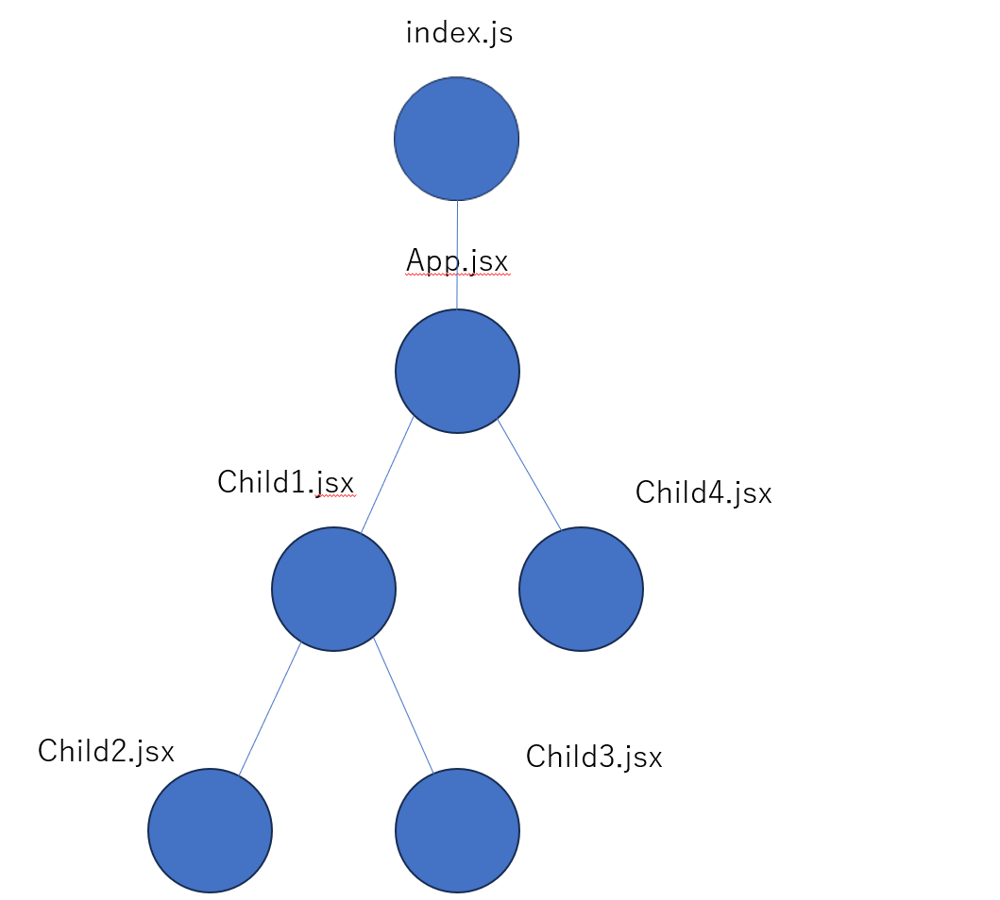

# 再レンダリングが起きる条件
再レンダリング: コンポーネントが頭からまた実行されて変更が反映される

再レンダリングが起きる3つのパターン
1. Stateが更新されたコンポーネント
2. Propsが更新されたコンポーネント
3. 再レンダリングされたコンポーネント配下のコンポーネント全て

コンポーネントの階層構造

このような時にApp.jsxがStateで更新された時は
全てのコンポーネントが再レンダリングされてしまう

child1がStateを更新した時はchild2, child3も再レンダリングされる